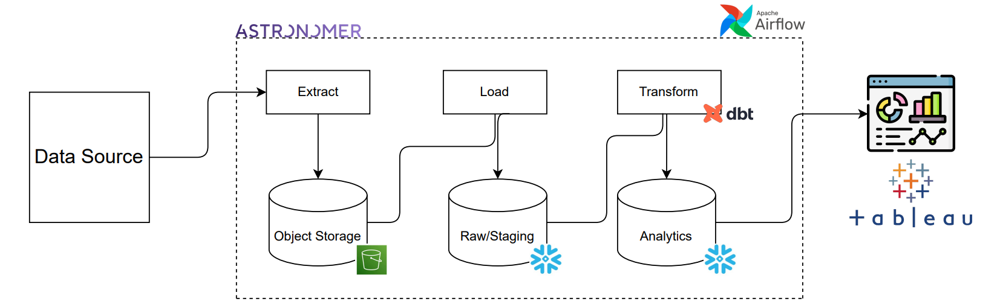
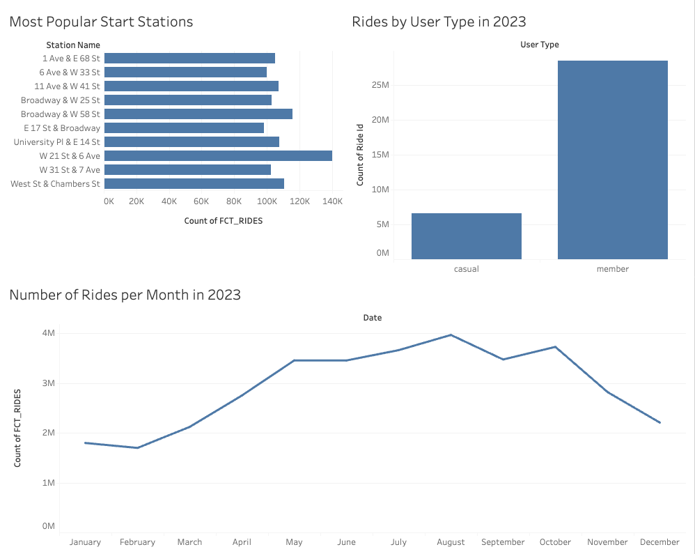
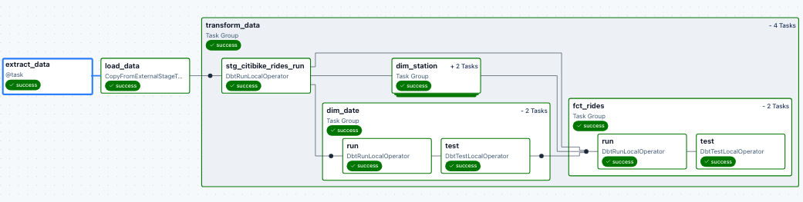

# CitiBike ELT Pipeline

## Project Architecture

This pipeline implements an ELT workflow orchestrated with **Astronomer/Airflow**, extracting raw data from the Citi Bike source into **AWS S3**, landing it in **Snowflake**, and transforming it with **dbt** into analytics-ready models. The architecture separates ingestion, staging, and analytics layers, keeping transformations modular and the warehouse easy to extend.

## Key Technical Highlights
- **Airflow & dbt Task Group (Cosmos)** to orchestrate extraction, loading, and transformations in a clean, maintainable workflow.
- **dbt** models and tests for versioned transformations and automated data quality checks.
- **Snowflake** warehouse organized into raw, staging, and analytics layers for reliable data processing and querying.

## Project Flow
1. Extract data from the Citi Bike source into **S3**.
2. Load into **Snowflake** raw table.
3. Transform with **dbt** into analytics models.

## Visualizations

## Setup
1. Install Astronomer CLI with `brew install astro`.
2. Install Docker Desktop.
3. Clone this repo.
4. `cd` into the repo.
5. Run `astro dev start` to spin up **Airflow**.
6. In the **Airflow UI**, enter connection logins for **Snowflake** and **AWS**.
7. Run the DAG in the **Airflow UI**.
